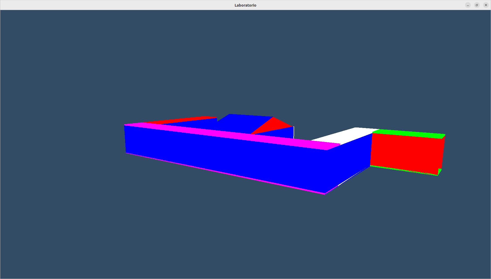
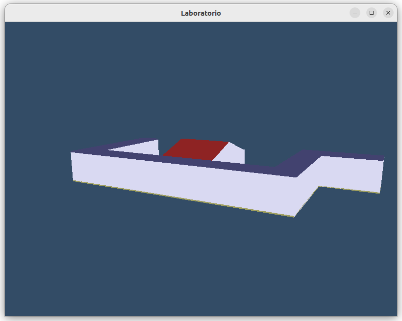
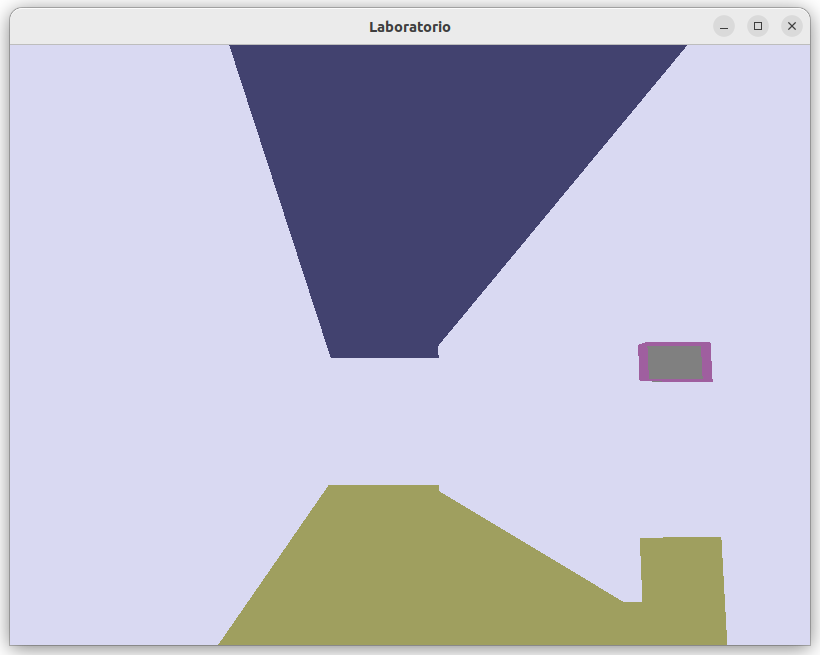
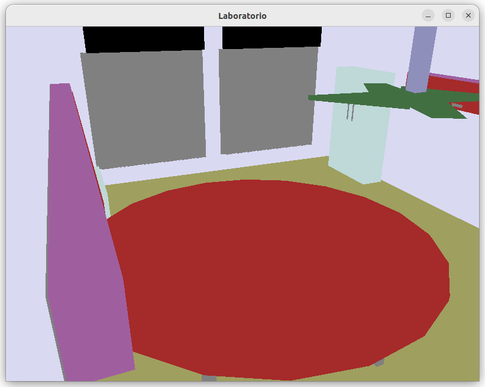
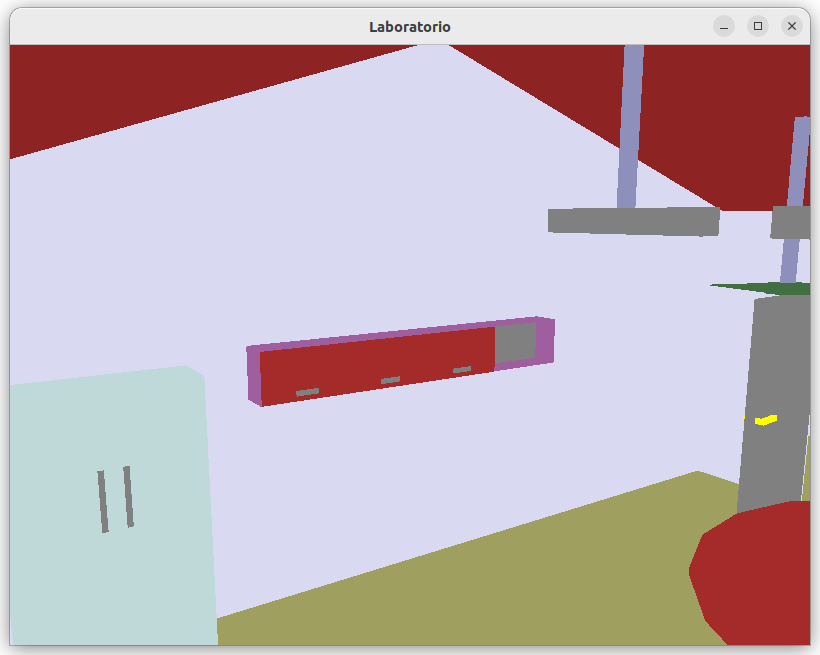
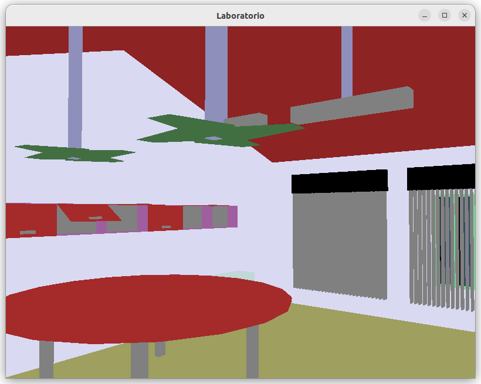
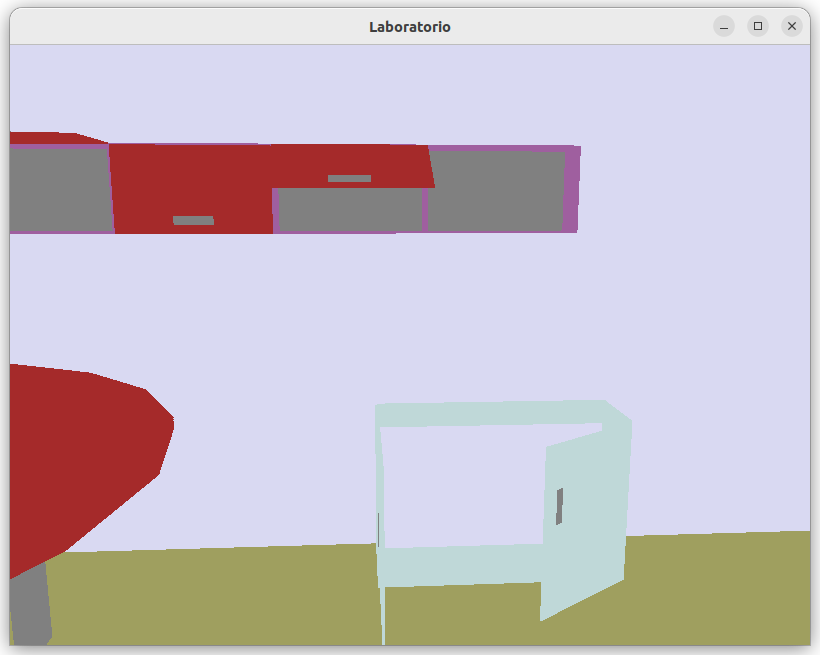

# Lab-IC-OpenGL
Repositório referente à AB1 de Computação gráfica. O trabalho consiste em uma renderização em 3D interativa de um laboratório do Instituto de Computação - UFAL A.C. Simões

## Compilação
* Execute ```make laccanLab```

## Execução
* Execute ```./laccanLab```  
(No momento o makefile só compila para Linux)

# Como se movimentar e interagir com o programa

## Fechar o programa
* Aperte ```Q``` para fechar

## Movimentação
* Utilize as setas direcionais para se locomover
* Aperte ```Z``` para mover para baixo
* Aperte ```Espaço``` para mover para cima
* Deixe o ```CAPS LOCK``` ligado ou mantenha o ```SHIFT``` pressionado para se mover mais rápido pela cena

### Interação com objetos
OBS: A tecla ```ALT``` altera se o lado esquerdo ou direito do objeto em questão será movimento  
O ```ALT``` desligado significa que o lado esquerdo do objeto (exemplo porta esquerda ou janela esquerda) estará sujeito a interações e vive-versa  

* Aperte ```O``` para abrir a porta do laboratório
* Aperte ```E``` para abrir a porta do armário da esquerda
* Aperte ```R``` para abrir a porta do armário da direita
* Aperte ```J``` para abrir a janela
* Aperte ```P``` para abrir a persiana

## Imagens

### Inicio



### Final



### Vendo a sala pela porta


### Corredor



### Vendo a sala por cima






### Janelas e persianas abertas


### Armários




